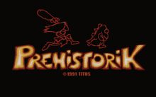

**英文名:** Prehistorik
**类型:** 动作游戏
**发行年:** 1991
**平台:** Amiga/PC
**操作系统:** Amiga/DOS

Amiga电脑上的游戏，后移植到PC。你必须挥舞着棍棒，在原始时代寻找你的食物，吃是你唯一的目标，当然一路上阻碍你的恐龙或生物都要用棍棒驱逐。游戏的各种物品造型都非常有趣(如敌人，食物)，画面的构色也非常活泼，最重要的是游戏操作流畅，使得耐玩程度大增.。各关最后的大型魔王也是游戏一大特色。
